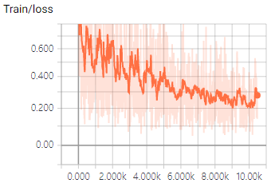
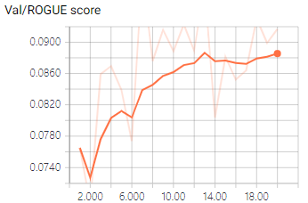

# KoGPT2-Summarization
### 모델

한국어 GPT-2 from [SKT-AI](https://github.com/SKT-AI/KoGPT2)

Pre-train 된 GPT-2를 문서 요약 데이터로 2차 pre-training

```
embedding size: 768
hidden size: 768
max input length: 1024
vocab size: 50000
number of layers: 12
number of attention heads: 12
```

### 학습 데이터

* 국립국어원
  * 신문 기사 요약 데이터
* 총 **13,167 문장**

### 학습

Nvidia 2080ti 8장으로 학습



